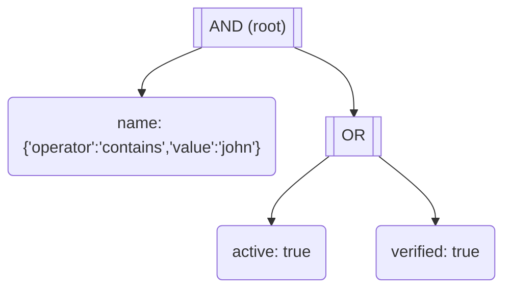

# Devtools

The `@jlnstack/filter/devtools` entry point provides utilities for visualizing filter expressions as Mermaid flowcharts.

## generateMermaid

Generate Mermaid diagram code from a filter:

```ts
import { generateMermaid } from "@jlnstack/filter/devtools"

const filter = useFilter(schema)
const mermaid = generateMermaid(filter.getFilter())

console.log(mermaid)
// flowchart TD
//   f_0[["AND (root)"]]
//   f_1("name: {'operator':'contains','value':'john'}")
//   f_0 --> f_1
//   f_2("active: true")
//   f_0 --> f_2
```

## getMermaidLiveUrl

Get a URL to view the diagram on [mermaid.live](https://mermaid.live):

```ts
import { getMermaidLiveUrl } from "@jlnstack/filter/devtools"

const filter = useFilter(schema)
const url = getMermaidLiveUrl(filter.getFilter())

console.log(url)
// https://mermaid.live/edit#base64:...
```

## Example Usage

Add a debug button to open the filter visualization:

```tsx
import { getMermaidLiveUrl } from "@jlnstack/filter/devtools"

function DebugFilter() {
  const filter = useFilter(schema)

  const openVisualization = () => {
    const url = getMermaidLiveUrl(filter.getFilter())
    window.open(url, "_blank")
  }

  return (
    <button onClick={openVisualization}>
      Visualize Filter
    </button>
  )
}
```

## Output Example

For a filter like:

```ts
and(
  condition("name", { operator: "contains", value: "john" }),
  or(
    condition("active", true),
    condition("verified", true)
  )
)
```

The generated Mermaid diagram looks like:


